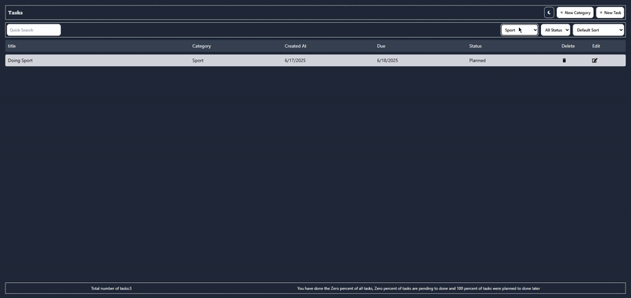

<a id="readme-top"></a>
This is the frontend for the **Task Management App**, built using **React**, **TypeScript**, and **Tailwind CSS** with a **custom Webpack configuration** and no build tool like Vite or Create React App.

<!-- PROJECT Demo -->

## Demo<!-- Required -->

<br />
<div align="center">
  <h3 align="center">Task Management Frontend</h3>
  <p align="center">
    A clean and responsive frontend built from scratch!
  </p>
  
</div>

<!-- TABLE OF CONTENTS -->

<details>
  <summary>Table of Contents</summary>
  <ol>
    <li>
      <a href="#about-the-project">About The Project</a>
      <ul>
        <li><a href="#built-with">Built With</a></li>
      </ul>
    </li>
    <li>
      <a href="#getting-started">Getting Started</a>
    </li>
    <li><a href="#dear-instructor">Contributing</a></li>
    <li><a href="#license">License</a></li>
  </ol>
</details>

<!-- ABOUT THE PROJECT -->

## About The Project

This frontend project is part of a full-stack task management app. It was intentionally built **without a boilerplate tool** like Create React App or Vite. Instead, I set up a **custom Webpack configuration**, gaining a deep understanding of bundling and development environments.

### ✨ Key Features:
- Built with **React** and **TypeScript**
- Managed state using **React Context** and the `useReducer` hook
- Responsive UI with **Tailwind CSS**
- Integrated backend APIs using a custom reusable `fetcher` function
- Fully responsive, accessible, and lightweight
- No external build tools used — fully manual Webpack setup

This project helped me deeply understand React’s rendering behavior, modular component structure, custom hooks, and manual bundling using Webpack.

<p align="right">(<a href="#readme-top">back to top</a>)</p>

### Built With

- 
- 
- 
- 


<p align="right">(<a href="#readme-top">back to top</a>)</p>

<!-- GETTING STARTED -->

## Getting Started

### 🔧 Prerequisites

- Node.js (v18 or higher recommended)

### ⚙️ Setup


1. Clone the repo
   ```sh
   git clone https://github.com/Mahdi-Golriz/task-management-frontend.git
   ```
2. Install NPM packages
   ```sh
   npm install
   ```
3. Run the project

   ```sh
   npm run start
   ```
<p align="right">(<a href="#readme-top">back to top</a>)</p>

🔐 Environment Variables
Create a .env file in the root:

```env
API_URL="http://localhost:5555/api"
NODE_ENV=development
```

## Dear Instructor

<a href="https://github.com/MRezaSafari">
  Reza Safari
</a>
<p align="right">(<a href="#readme-top">back to top</a>)</p>

## :closed_book: License

Released in 2024 :closed_book: License

Made by Mahdi Golriz 🚀.
This project is under the [MIT license](https://opensource.org/licenses/MIT).

Give a ⭐️ if this project helped you!
